# Connexa

Cross-platform peer-to-peer meetings and remote support built around a
temporary **9-digit session code**:

> Start a session → get `847 291 653` → share it → others enter it → connected.

Audio, video, screen sharing, chat, file transfer and remote control run
directly between participants over WebRTC. A small Rust server coordinates
rooms. For meetings too big for peer-to-peer, it includes its own SFU, written
in Rust. The Windows app can host a server itself on a LAN.

## Screenshots

Captured from real sessions running against the local server. Chrome's
built-in fake camera stands in for webcams, and the shared "screens" are
generated images. Stubs replace two native layers: remote control (no real
input was injected) and Android capture (a simulated bridge feeds the real
Android web bundle).

| Start or join | Three people, P2P chat |
|---|---|
| 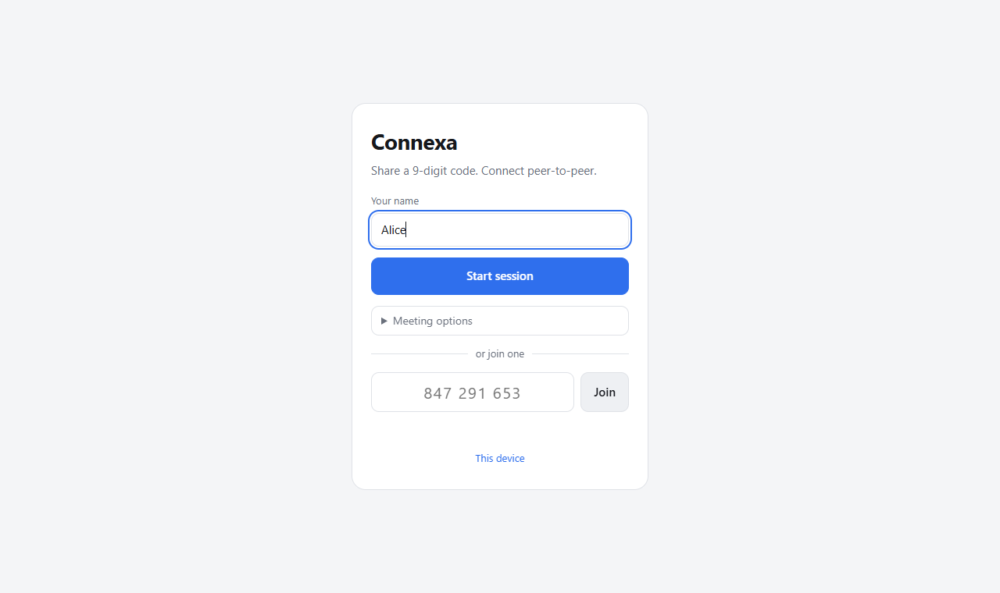 | 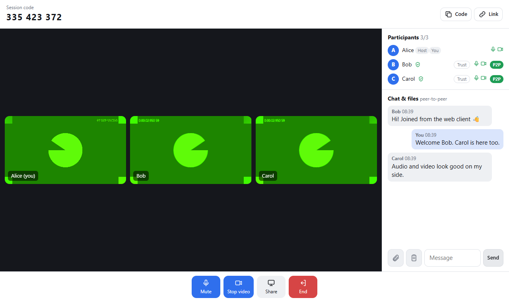 |

| Remote control request (host) | Controlling a remote screen (viewer) |
|---|---|
| 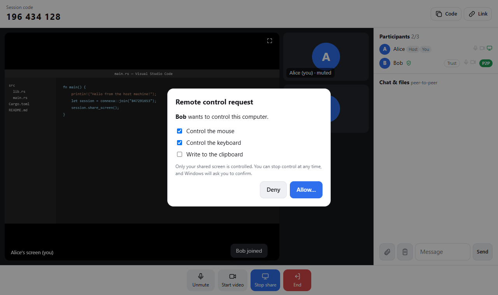 | 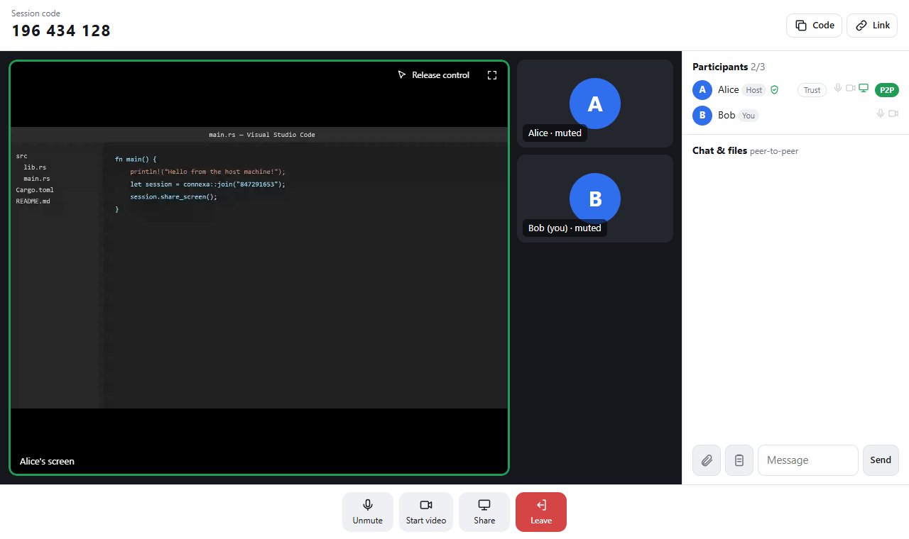 |

| File transfer + clipboard | Screen sharing |
|---|---|
| 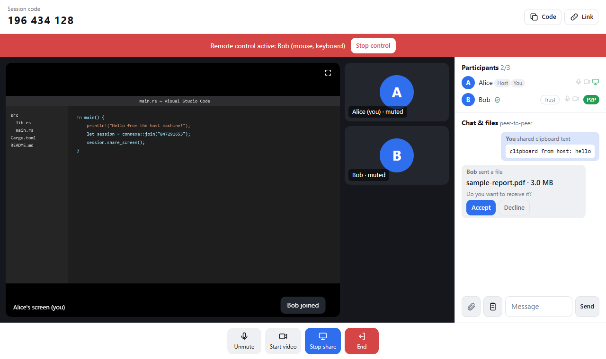 | 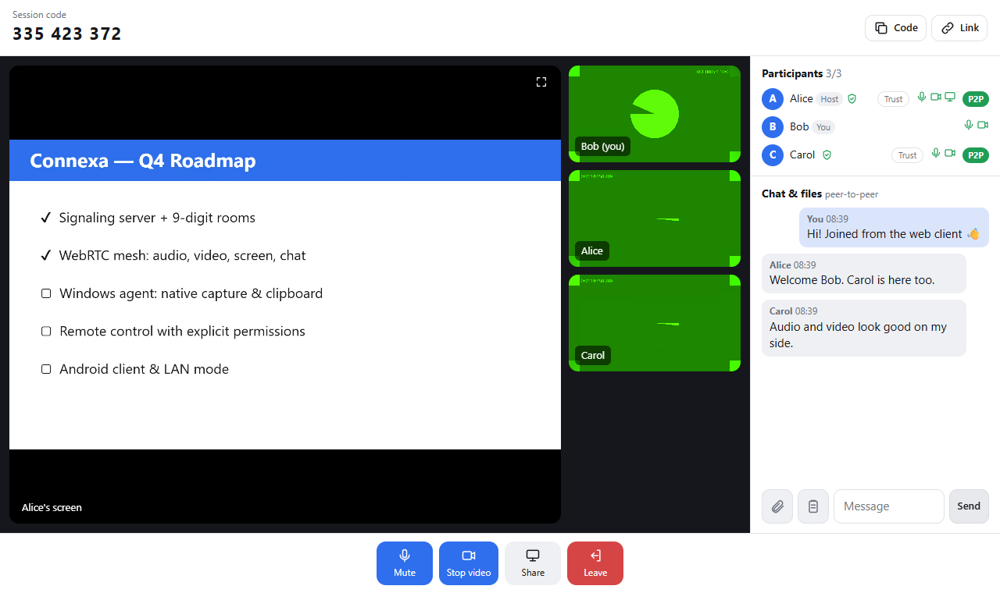 |

| Windows app: LAN mode QR invite (real app) | Windows app: LAN session with a browser guest (real app) |
|---|---|
| 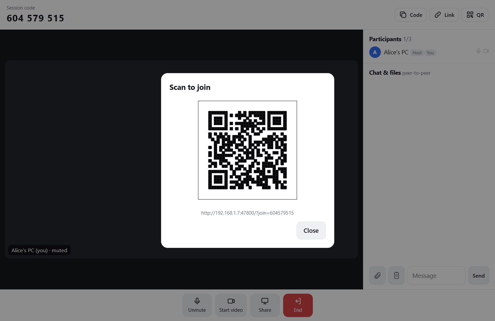 | 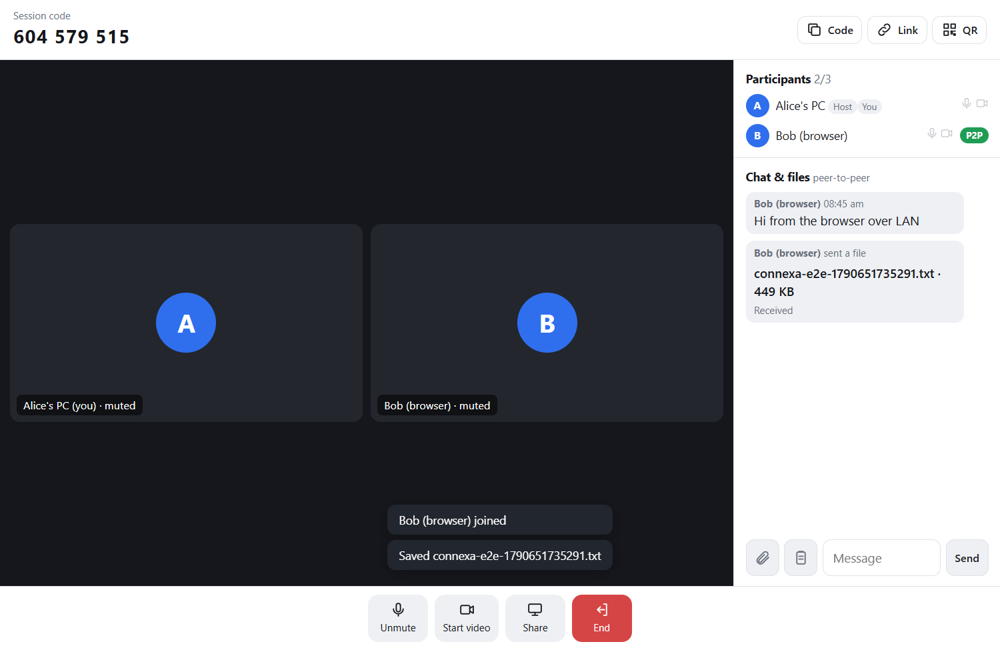 |

| Large meeting: 5 people through the Rust SFU | Lobby: host approves a verified device |
|---|---|
| 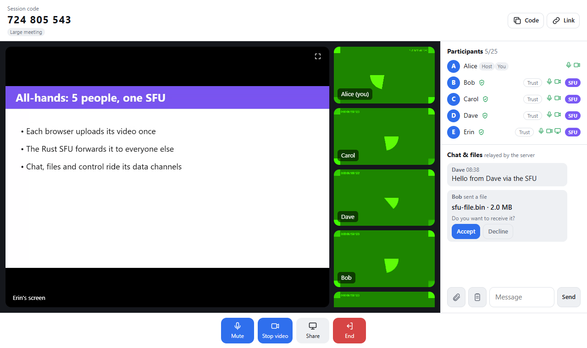 | 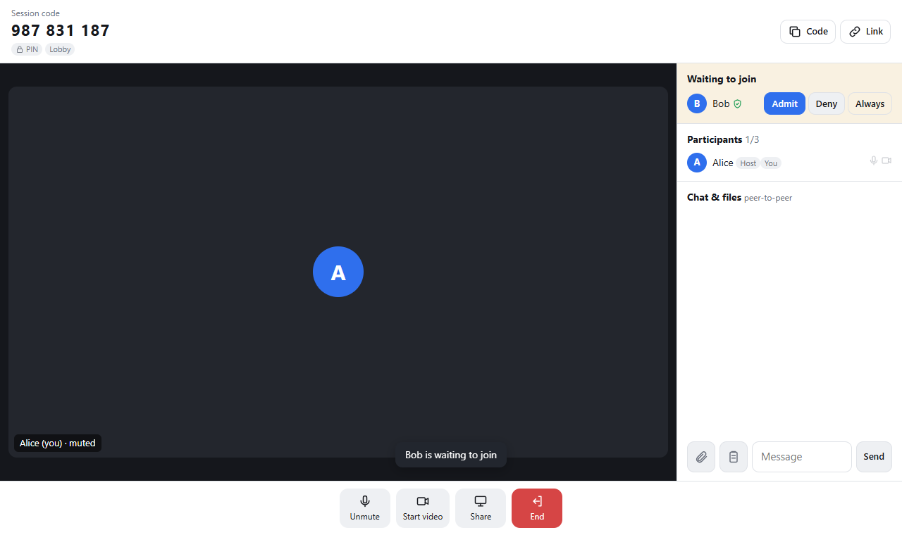 |

| This device: ID, trusted devices, activity log | Android screen share (native capture, simulated) |
|---|---|
| 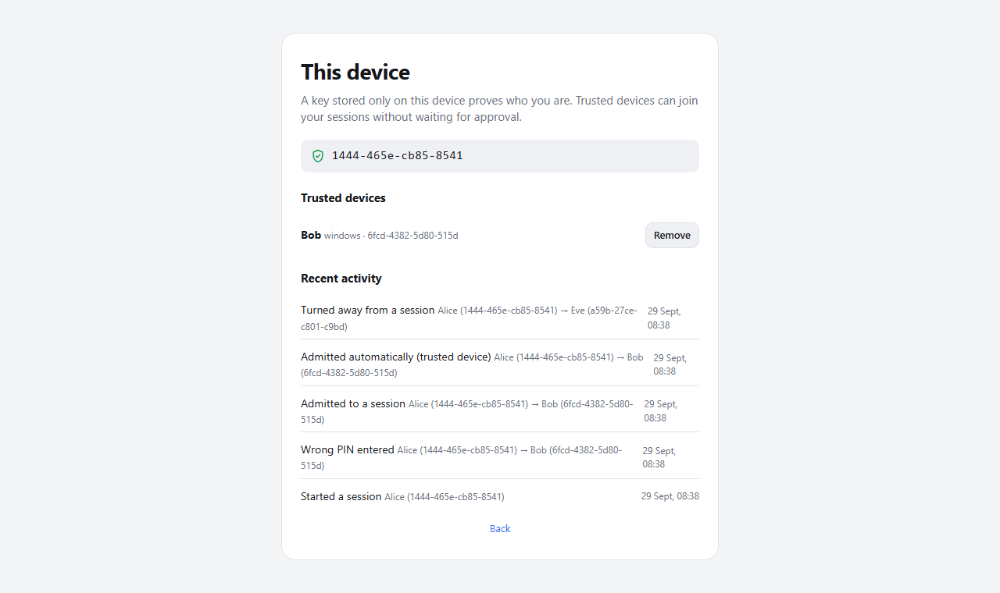 | 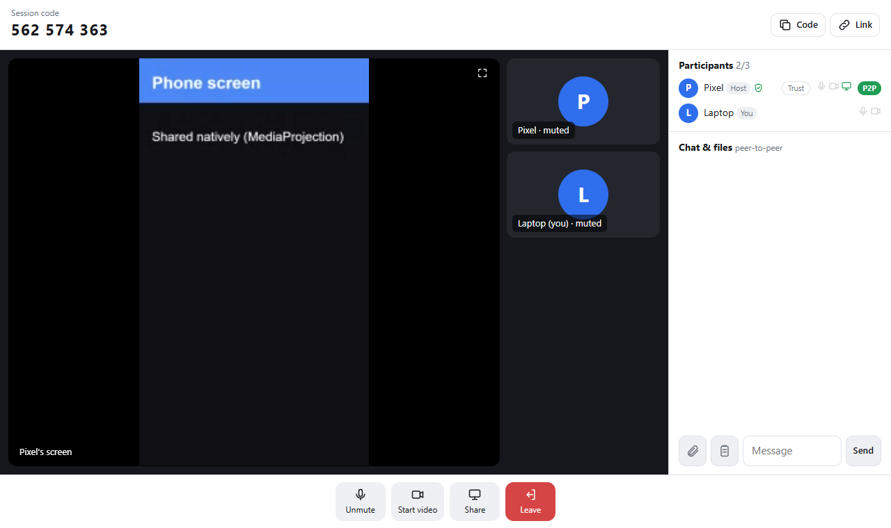 |

| Phone layout | Chrome extension |
|---|---|
| 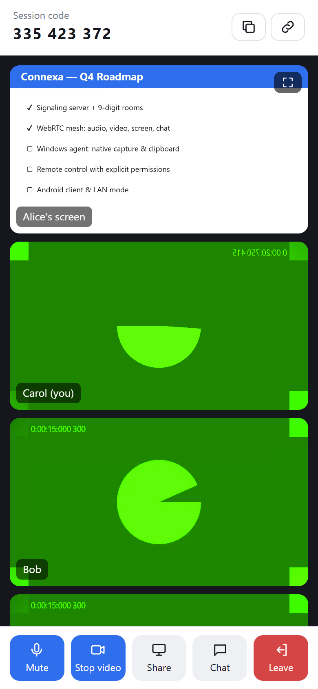 | 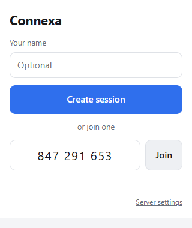 |

## Features

| | Browser | Chrome extension | Windows app | Android app |
|---|:-:|:-:|:-:|:-:|
| Create or join with a 9-digit code | ✅ | ✅ | ✅ | ✅ |
| Mic, camera, P2P chat | ✅ | ✅ | ✅ | ✅ |
| Share screen / window / tab | ✅ | ✅ | ✅ | ✅ (whole screen, native) |
| Send and receive files | ✅ | ✅ | ✅ | ✅ |
| Share clipboard text | ✅ | ✅ | ✅ | ✅ |
| Request control of a remote screen | ✅ | ✅ | ✅ | ✅ |
| **Be** remote-controlled (mouse/keyboard) | – | – | ✅ | – |
| LAN mode: host a session without a server | – | – | ✅ | join by URL |
| Large meetings (up to 25, via SFU) | ✅ | ✅ | ✅ | ✅ |
| PIN, lobby, verified devices, trusted devices | ✅ | ✅ | ✅ | ✅ |

The Rust server also handles:
- **Rooms:** presence, SDP/ICE relay, host end, room expiry, rate limiting, and
  reconnect with session resume.
- **Large meetings:** a built-in SFU. Each link is labelled **P2P** (direct),
  **Relay** (TURN) or **SFU** (large meeting).
- **Security:** PIN, lobby, device-key verification, trusted devices and a
  per-device audit log (Postgres).
- **Operations:** multi-node clustering over Redis and Prometheus metrics.

It deploys with Docker Compose (Caddy HTTPS, Postgres, coturn, and optional
Prometheus + Grafana) or Kubernetes. See [docs/deployment.md](docs/deployment.md).

Remote control needs explicit consent on the controlled machine: an in-app
request with per-permission checkboxes, then a native Windows confirmation.
Every input is re-checked in Rust, and a red **Stop control** banner is always
visible. See [docs/security.md](docs/security.md#remote-control).

## Downloads

CI builds every commit on `main`. Pushing a `v*` tag publishes a GitHub Release
containing:

- `Connexa_<version>_x64-setup.exe`: Windows installer (per-user, no admin rights)
- `Connexa-android.apk`: Android app (debug-signed, for sideloading)
- `Connexa-chrome-extension.zip`: load unpacked in `chrome://extensions`

## Run locally

Requirements: Rust (stable, edition 2024) and Node 18+.

```bash
cd clients && npm install && npm run build && cd ..
cargo run -p signaling-server
```

Open http://localhost:8080 in two browser windows. Click **Start session** in
one and enter the code in the other.

### Windows app

Needs WebView2 (built into Windows 10/11) and the MSVC build tools:

```bash
npm --prefix clients run build:desktop
cd apps/desktop && npx --prefix ../../clients tauri build
```

This produces `target/release/Connexa.exe` and an installer under
`target/release/bundle/nsis/`. By default the app connects to
`ws://localhost:8080/ws`; change it under **Server settings**. Choose **LAN
mode** to host or join sessions on the local network without a server
([details](docs/networking.md#lan-mode)).

### Android app

Needs JDK 17, the Android SDK (API 34) and Gradle 8.7+:

```bash
npm --prefix clients run build:android
gradle -p clients/android assembleDebug
```

The APK is written to `clients/android/app/build/outputs/apk/debug/`. The
emulator reaches a server on your PC at `ws://10.0.2.2:8080/ws`, which is the
default. On a real phone, set your server URL under **Server settings**.

### Chrome extension

1. `npm --prefix clients run build:extension`
2. Open `chrome://extensions`, turn on **Developer mode**, click **Load
   unpacked** and pick `clients/chrome-extension/dist`.
3. The extension uses `ws://localhost:8080/ws` by default. Change it under
   **Server settings** in the popup.

### Tests

```bash
cargo test --workspace
```

```bash
npm --prefix clients run typecheck
```

## Deploy

- **One host:** in `infrastructure/deployment`, copy `.env.example` to `.env`,
  fill it in, then run `docker compose up -d --build`. Add
  `--profile monitoring` for Prometheus and Grafana.
- **Kubernetes:** `kubectl apply -k infrastructure/kubernetes`, which runs 3
  signaling nodes with Redis and Postgres.

Details are in [docs/deployment.md](docs/deployment.md). Browsers need HTTPS
for the camera, mic and screen sharing anywhere except `localhost`.

## Docs

- [Architecture and roadmap](docs/architecture.md)
- [Signaling and peer protocol](docs/protocol.md)
- [Security model, including remote control](docs/security.md)
- [Networking, SFU, clustering, LAN mode and configuration](docs/networking.md)
- [Deployment and monitoring](docs/deployment.md)
